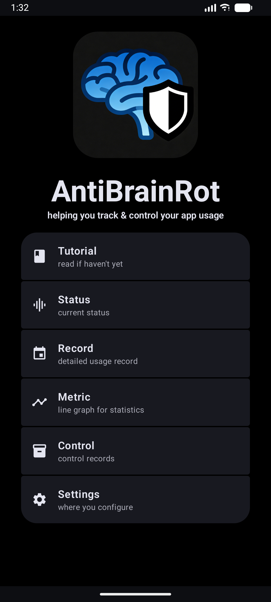
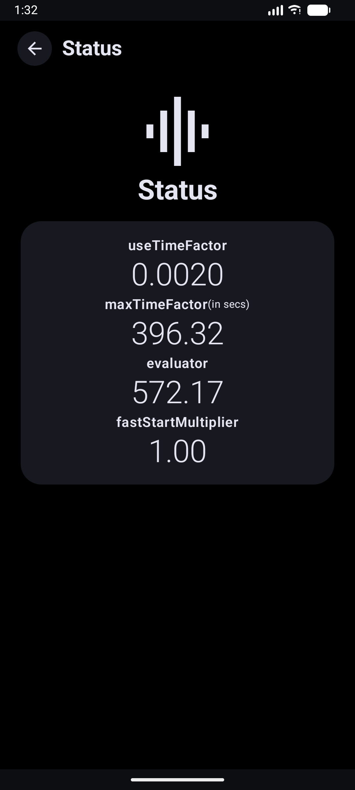
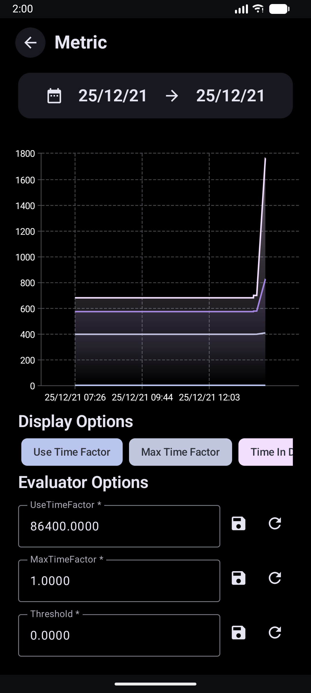
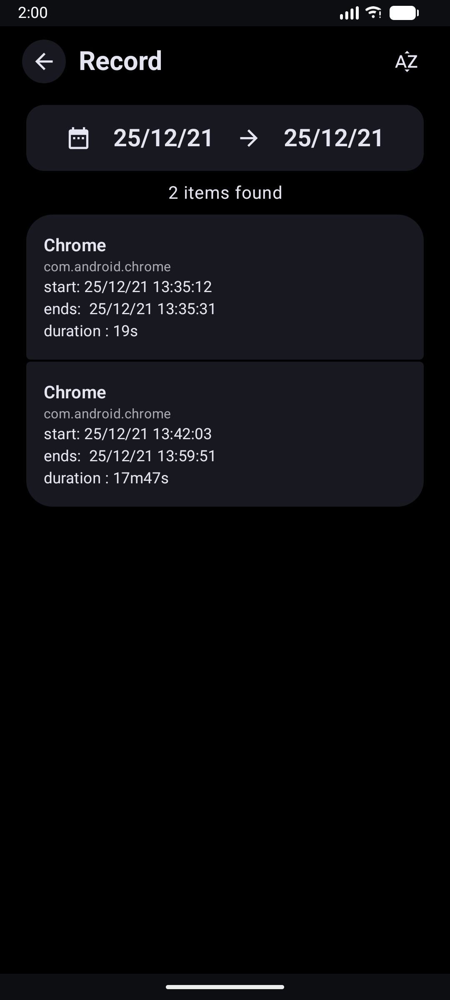
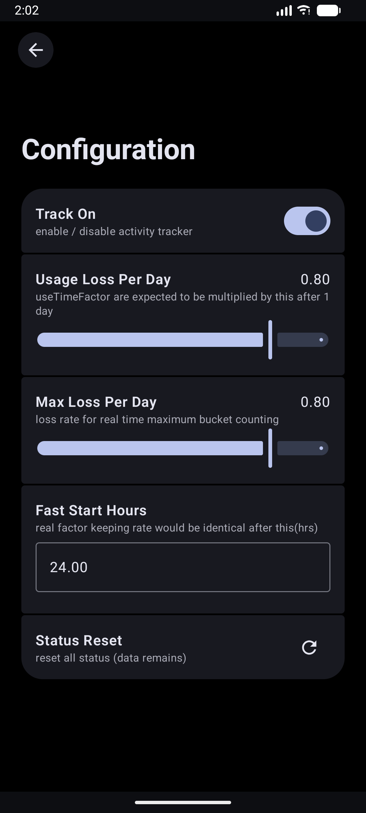
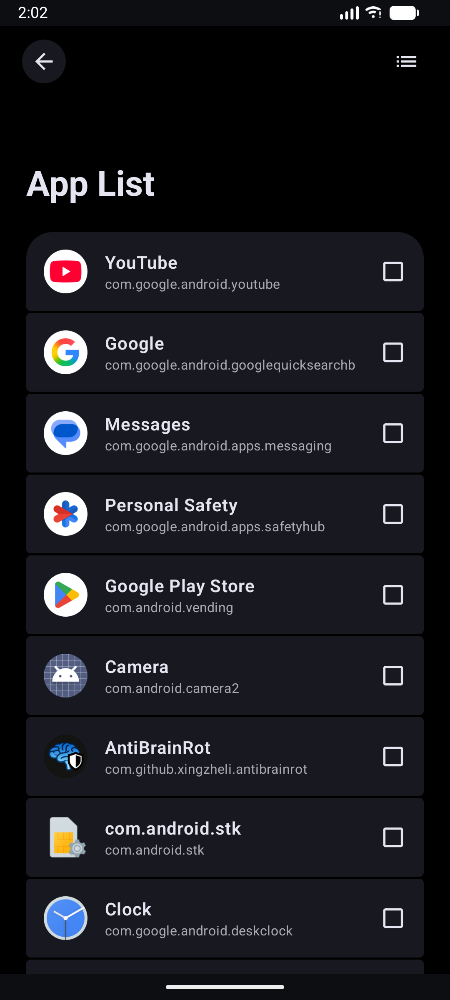
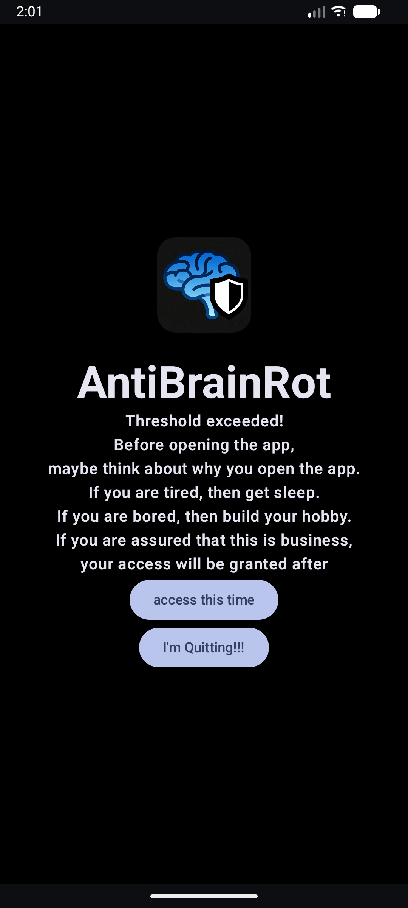

# AntiBrainRot

<div style="display:flex;justify-content:center;width:100%;margin-bottom:24px;">
	<image style="height: 128px;border-radius:20%" src="./assets/icons/IconDarkFull.png">
</div>

AntiBrainRot is an Android application designed to track and control app usage, helping users break free from the addictive loops of apps like TikTok, YouTube, Bilibili, and other social media platforms. Built with modern Android technologies, it uses a unique metrics system based on the leaky bucket model to monitor and potentially intervene in excessive app usage.


## 🚀 Features

- **App Usage Tracking**: Monitors your app usage patterns using Accessibility Service
- **Advanced Metrics System**: Uses a unique "leaky bucket" model with useTimeFactor and maxTimeFactor metrics
- **Smart Intervention**: Blocks access to monitored apps when usage thresholds are exceeded
- **Detailed Analytics**: Provides metrics visualization and usage records
- **Customizable Controls**: Configure which apps to monitor and intervention thresholds
- **Real-time Monitoring**: Tracks app switches and usage duration in real-time

## 📸 Screenshots

| | | | |
|:---:|:---:|:---:|:---:|
|  |  |  |  |
|  |  |  |  |


## 🛠️ Tech Stack

- **Language**: Kotlin
- **UI Framework**: Jetpack Compose
- **Build System**: Gradle (Kotlin DSL)
- **Architecture**: Modern Android Architecture Components
- **Database**: Room for local data persistence
- **Data Storage**: DataStore Preferences for settings
- **Navigation**: Jetpack Navigation Compose
- **Charts**: Vico Compose for data visualization

## 📋 Prerequisites

- Android Studio (latest version recommended)
- Android SDK 26+ (minimum API level 26, targeting API level 36)
- JDK 11 or higher
- Gradle 8.0+

## 🚀 Getting Started

### Cloning the Repository

```bash
git clone https://github.com/XingZhe-Li/AntiBrainRot.git
cd AntiBrainRot
```

### Building the Project

1. Open Android Studio
2. Select "Open an existing project"
3. Navigate to the project directory
4. Android Studio will automatically sync the Gradle files

Alternatively, build from command line:

```bash
# On Windows
gradlew.bat build

# On macOS/Linux
./gradlew build
```

### Running the Application

1. Connect an Android device or start an emulator
2. In Android Studio, click the "Run" button (green triangle)
3. Or use the command line:
   ```bash
   # On Windows
   gradlew.bat installDebug

   # On macOS/Linux
   ./gradlew installDebug
   ```

### Setting Up the App

1. Install the app on your Android device
2. Grant Accessibility Service permission to the app (required for tracking)
3. Configure which apps to monitor in Settings > App List
4. Set your intervention thresholds in Settings > Control
5. Enable tracking and control features as needed

## 🏗️ Project Structure

```
app/                    # Main application module
├── src/main/java/      # Kotlin source files
│   └── com/github/xingzheli/antibrainrot/
│       ├── core/           # Core logic (tracker algorithms)
│       ├── data/           # Data layer (Room DB, DataStore)
│       ├── shared/         # Shared utilities
│       ├── ui/             # Compose UI components
│       │   └── interfaces/ # Navigation and screens
│       ├── utils/          # Utility functions
│       ├── MainActivity.kt # Main entry point
│       ├── MainApplication.kt # Application class
│       └── MainAccessibilityService.kt # Accessibility service
├── src/main/res/       # Resources (layouts, drawables, values)
├── src/main/AndroidManifest.xml  # App manifest
└── build.gradle.kts    # Module build configuration
assets/                 # Static assets
gradle/                 # Gradle wrapper and configurations
build.gradle.kts        # Root project build configuration
settings.gradle.kts     # Project modules configuration
```

## 📊 Metrics System

AntiBrainRot implements a unique metrics system based on the "leaky bucket" model:

- **useTimeFactor**: Represents the estimated percentage of time spent on apps
- **maxTimeFactor**: Denotes the capacity of your app usage "buffer" (in seconds)
- **Evaluator**: A calculated value combining both factors to determine intervention points
- **Fast Start Algorithm**: Adjusts tracking sensitivity during initial usage periods

## 🔧 Configuration

The app offers extensive configuration options:

- **Tracking Settings**: Enable/disable app tracking
- **Control Settings**: Set intervention thresholds and methods
- **UI Settings**: Customize interface behavior
- **Algorithm Config**: Fine-tune the leaky bucket model parameters

## 🧪 Testing

Run unit tests:
```bash
./gradlew test
```

Run instrumented tests:
```bash
./gradlew connectedAndroidTest
```

## 📦 Building APK

To generate a debug APK:
```bash
./gradlew assembleDebug
```

To generate a release APK:
```bash
./gradlew assembleRelease
```

## ⚠️ Permissions

This app requires Accessibility Service permission to function properly. This permission allows the app to:
- Track app usage across the entire system
- Monitor app launch events
- Intervene when usage thresholds are exceeded

## 🤝 Contributing

1. Fork the repository
2. Create a feature branch (`git checkout -b feature/amazing-feature`)
3. Commit your changes (`git commit -m 'Add some amazing feature'`)
4. Push to the branch (`git push origin feature/amazing-feature`)
5. Open a Pull Request

### Development Guidelines

- Follow Kotlin coding conventions
- Write meaningful commit messages
- Add tests for new features
- Document public APIs

## 📄 License

This project is licensed under the GNU General Public License v3 (GPLv3):
- [LICENSE](LICENSE) - Full GPL v3 license text
- [LICENSE-APACHE2](LICENSE-APACHE2) - Apache 2.0 license for compatible components

## 🐛 Issues

If you encounter any bugs or issues, please [open an issue](https://github.com/XingZhe-Li/AntiBrainRot/issues) on GitHub with a detailed description.

## 🆘 Support

For support, you can:
- Check the [Issues](https://github.com/XingZhe-Li/AntiBrainRot/issues) section
- Create a new issue for bug reports or feature requests
- Contact the maintainer through GitHub

---

Made with ❤️ to help people regain control over their digital habits.
